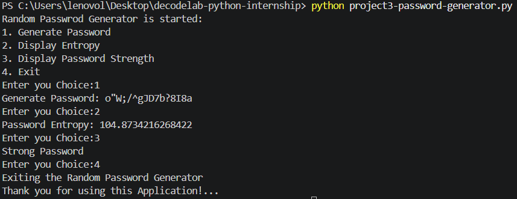

# Random Password Generator Application

A simple command-Line based Random Password Generator Application built using Python.

This project was created as part of a Python internship project to practice:
- Python fundamentals
- Secure Password Generation
- Mathematical Calculations
- Functions
- String Handling
- User Interaction
- Basic Security Concepts

---

# Project File
```bash
project3-password-generator.py
```

---

# Features Implemented

1. Generate Secure Random Password
2. 16 Character Password Generation
3. Uses `secrets.choice()` for secure randomness
4. Uses `.join()` for combining characters
5. Entropy Calculation
6. Password Strength Checker
7. Menu Driven Interface
8. Uppercase, Lowercase, Numbers, and Symbols Support

---

# Technologies Used

- Python
- Secrets module
- String module
- Math module
- Functions
- Conditional Statements
- Loops

---

# How the Program Works

The application generates a secure random password using:
- Letters
- Numbers
- Symbols

The password is generated using:
- `secrets.choice()`
- `.join()` function

The application also calculates:
- Password Entropy
- Password Strength

using a mathematical entropy formula.

---

# Menu Options

```text
1. Generate Password
2. Display Entropy
3. Display Password Strength
4. Exit
```

---

# Functions Implemented

## generate_password()

Generates a secure random 16-character password using:

- `secrets.choice()`
- `.join()`

The password contains:
- Uppercase letters
- Lowercase letters
- Numbers
- Symbols

---

## display_entropy()

Calculates password entropy using the formula:

```text
E = L × log₂(R)
```

Where:
- E = Entropy
- L = Password Length
- R = Number of Possible Characters

Higher entropy means:
- stronger password
- harder to predict

---

## display_password_strength()

Displays password strength based on entropy value.

### Strength Levels

| Entropy | Strength |
|---|---|
| Less than 40 | Weak |
| 40 - 80 | Medium |
| Greater than 80 | Strong |

---

# Character Sets Used

```python
string.ascii_letters
string.digits
string.punctuation
```

---

# Example Generated Password

```text
A@7xP!2qL#9mT$4z
```

---

# Sample Output

## Main Menu

```text
1. Generate Password
2. Display Entropy
3. Display Password Strength
4. Exit
```

---

# Screenshots

## Main Menu

```md

```

---

# How to Run the Program

## Step 1

Install Python on your system.

Download from:

https://www.python.org/

---

## Step 2

Open terminal or command prompt.

---

## Step 3

Navigate to the project folder.

Example:

```bash
cd Project3
```

---

## Step 4

Run the program.

```bash
python project3-password-generator.py
```

---

# Concepts Practiced

This project helped practice:

- Secure Randomness
- Password Generation
- Mathematical Calculations
- Entropy Calculation
- Function Design
- String Handling
- User Input Handling
- Security Concepts

---

# Author

Created as part of DecodeLabs Python Internship.
